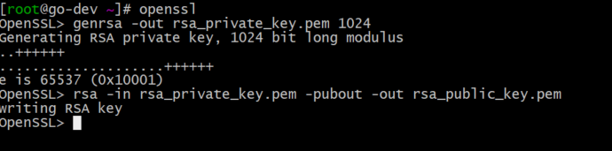

# zeus 宙斯权限后台
</img>

[](https://www.golang.org/)
[](https://github.com/casbin/casbin)

#### 项目介绍
Zeus 宙斯权限后台，为企业提供统一后台权限管理服务。项目使用golang beego框架开发，用jwt+casbin做权限管理,提供OAuth2.0 的Restful api 接口，为企业后台系统提供
统一菜单管理、权限管理、员工管理、配置中心，同步企业微信、钉钉，同步企业组织架构，打通jenkis、jira、gitlab、企业邮箱、OA、财务软件等内外部系统，解决企业多个
软件和平台账号不同步的痛点。

## Features
- 登录/登出
- 权限管理
    - 用户管理
    - 角色管理
    - 部门管理
    - 项目管理
    - 菜单管理
## Roadmap
- 支持企业微信/钉钉登陆
- 同步企业组织架构和用户
- 风控
- 操作日志监控
- 配置中心
- 应用中心
# Docker 部署
可参考 [Docker Documentation][2] 或者直接看[官方文档][1]
# 架构
</img>
### 快速开始
````
export GOPROXY=https://goproxy.io
export GO111MODULE=on
go mod tidy
cd cmd/api-server
go build -o zeus
./zeus

````
# 数据移值

```bash
# 执行 sql 语句
mysql> source ./install/all.sql;
mysql> source ./install/casbin.sql;

# 分别导入到auth、casbin库
```

## Git 工作流

### 从官方仓库 fork 代码

1. 浏览器访问 https://github.com/bullteam/zeus
2. 点击 "Fork" 按钮 (位于页面的右上方)

### 从你自己的仓库 Clone 代码

```bash
cd $NAFTIS
git clone https://github.com/$YOUR_GITHUB_ACCOUNT/zeus
cd naftis
git remote add upstream 'https://github.com/bullteam/zeus'
git config --global --add http.followRedirects 1
```

### 创建分支并修改代码

```bash
git checkout -b my-feature # 创建一个 my-feature 分支
# 修改代码，加入你自己的变更
```

### 让你 fork 仓库和官方仓库同步

```bash
git fetch upstream
git rebase upstream/master
```

### 向你 fork 仓库提交 commits

```bash
git add .
git commit
git push origin my-feature # 推送 my-featur 到你自己的仓库
```
### 提交 PR

```bash
你可以访问 https://github.com/$YOUR_GITHUB_ACCOUNT/zeus 或者  https://github.com/bullteam/zeus 来浏览你的分支 (比如 "my-feature")。

点击 "Compare" 按钮来比较变更, 然后点击你的 "my-feature" 分支旁边的 "Pull request" 按钮来提交 PR。
```

### Review 代码

一个 PR 必须至少有一个人 review，review 无误后由 admin 合并至 master 分支。

## 代码结构

```bash

```
## 代码风格
- [Go: CodeReviewComments](https://github.com/golang/go/wiki/CodeReviewComments)

# openssl jwt 密钥生成
</img>
# Demo
* [demo](http://admin.bullteam.cn)
# WebUI
* [官方](https://github.com/bullteam/zeus-ui)
# API文档
* [POSTMAN](https://documenter.getpostman.com/view/159835/Rzfjk7Jh)

[1]: https://docs.docker.com/ "Docker Documentation"
[2]: https://github.com/yeasy/docker_practice "docker_practice"


