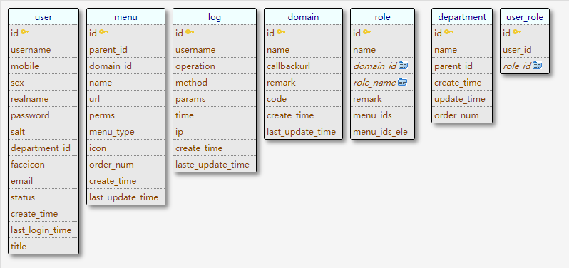

# zeus 宙斯权限后台
</img>

[](https://www.golang.org/)
[](https://github.com/casbin/casbin)

#### 项目介绍
Zeus 宙斯权限后台，为企业提供统一后台权限管理服务。项目使用golang beego框架开发，用jwt+casbin做权限管理,提供OAuth2.0 的Restful api 接口，为企业后台系统提供
统一菜单管理、权限管理、员工管理、配置中心，同步企业微信、钉钉，同步企业组织架构，打通jenkis、jira、gitlab、企业邮箱、OA、财务软件等内外部系统，解决企业多个
软件和平台账号不同步的痛点。

## Features
- 登录/登出
- 权限管理
    - 用户管理(人员管理)
    - 角色管理(功能权限管理)
    - 部门管理
    - 项目管理
    - 菜单管理
- 个人帐户
    - 第三方登陆（钉钉）
    - 安全设置（Google 2FA 二次验证）

## Roadmap
- 组织架构管理(同步钉钉)
- 风控
- 操作日志监控
    - 登陆日志
    - 异常登陆
    - 操作日志
- 数据权限管理
- 页面管理
    - 页面配置管理
- 配置中心
- 应用中心
- 个人帐户
    - 手机验证
    - 邮箱验证
    - 增加支持企业微信登陆
    
- [支持2FA认证](http://www.ruanyifeng.com/blog/2017/11/2fa-tutorial.html)
  
# Docker 部署
可参考 [Docker Documentation][2] 或者直接看[官方文档][1]

本项目参考，可以一键部署该项目 [docker-composer 部署脚本](http://github.com/bullteam/deploy)

# 架构
</img>

# 数据库E-R图
</img>

### 快速开始
需要golang 1.11+ 编译环境,设置git clone 权限
````
git clone git@github.com:bullteam/zeus.git
export GOPROXY=https://goproxy.io
export GO111MODULE=on
cd cmd/api-server
go build -o zeus
./zeus start -c ../../config

````
# 数据移值

```bash
# 执行 sql 语句
mysql> source ./install/auth.sql;
mysql> source ./install/casbin.sql;

# 分别导入到auth、casbin库
```

## Git 工作流

[Git 协作工作流](docs/Cooperation.md)

# openssl jwt 密钥生成
[openssl jwt 密钥](docs/GenrsaKey.md)
# 演示 Demo
* [demo](http://admin.bullteam.cn)  账号 admin  密码  123456   （为了防止恶意使用不定时重置，请各位客官尽情享用）
  
# 接入权限系统 client demo
* [python-client](https://github.com/bullteam/zeusclient-python)
* [php-client](https://github.com/bullteam/zeusclient-php)
* [java-client](https://github.com/bullteam/zeusclient-java)
* [go-client](https://github.com/bullteam/zeusclient-go)
# WebUI
* [官方](https://github.com/bullteam/zeus-ui)
# API文档
API 开发文档如下：
* [POSTMAN](https://documenter.getpostman.com/view/159835/Rzfjk7Jh)

[1]: https://docs.docker.com/ "Docker Documentation"
[2]: https://github.com/yeasy/docker_practice "docker_practice"

## 开发者

* [wutongci](http://github.com/wutongci)
* [funlake](https://github.com/funlake)
